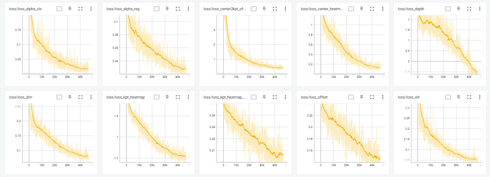
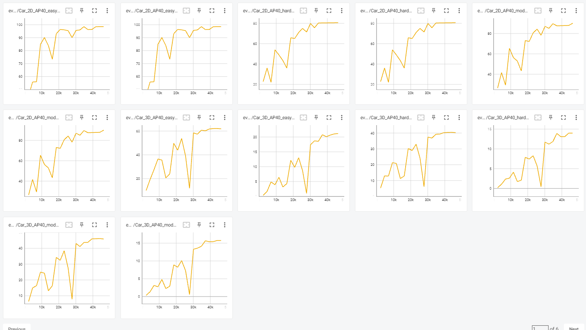
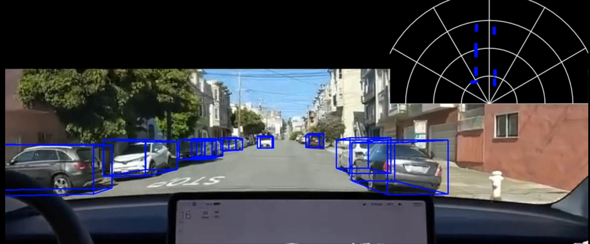
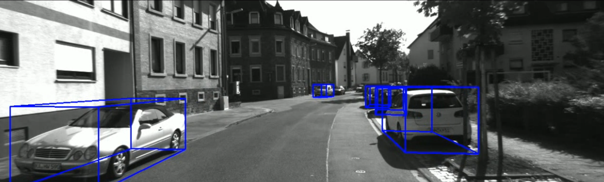
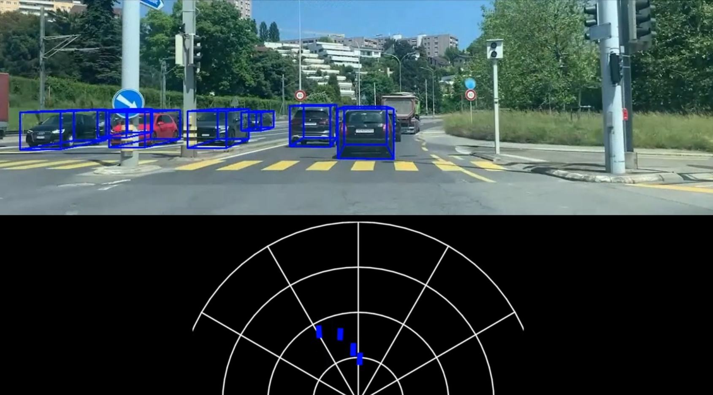

# 3d vehicules localization - Deep learning for autonomous vehicles EPFL
## Description
For our project, we have the task to implement 3d vehicle localization

Among the recent research we read through, we selected a state-of the art model that already demonstrated very high accuracy and high fps.

This model however is trained on single frames and therefore has no sense of previous detections, resulting in vehicle positions no longer being inferred as soon as they are obstructed or no longer visible.

We therefore improved the model with Multi Object Tracking, which requires computing the 3d IoU of all bounding boxes into an IoU matrix and then using the Hungarian algorithm to assign each bounding box to a sequence of detections, or tracklet. 

For each tracklet, we then used a Kalman Filter to predict the future tracklet position and fuse this prediction with the new detection, assuming constant linear velocity. 

We further improved our tracking by replacing the Kalman Filter with two Long Short-Term Memory networks, one for predicting the next object state and one for combining this with the new detection. The LSTM enables us to smoothly update the velocity and states of each object independently.  


Results demonstrate the model is able to still determine the vehicles position even when they get obstructed by other objects or when they are cut by the edge of the camera frame.

The report is based on the **[MonoCon: Learning Auxiliary Monocular Contexts Helps Monocular 3D Object Detection (AAAI, 2022)](https://arxiv.org/abs/2112.04628)** and **[Monocular Quasi-Dense 3D Object Tracking](https://arxiv.org/abs/2103.07351)**

If you have any question about this project, you can contact us at
- vincent@gherold.com
- lugonnoah@gmail.com

## Summary
### Results with our video sample
This video shows a quick inference of our model: 


https://github.com/vita-student-projects/3dvehicule_localization_gr24/assets/29159082/bc0d441e-a309-493e-bda1-7c5a2526adf5


### Features
- [x] KITTI Evaluation
- [x] Visualization (2D Bounding Box + Projected 3D Bounding Box)
- [x] Visualization (Bird Eye's View)
- [x] Video Inference using KITTI Raw Data Sequences and custom raw video sequences

#### 3D Metric on Car Class KITTI evalution
|                | AP40@Easy     | AP40@Mod.     | AP40@Hard     |
| -------------- | ---------     |-----------    |-----------    | 
| This Repo      | 26.31 | 19.01 | 15.98 |
| MonoCon(paper) | 26.33         | 19.03         | 16.00         |

  

## Preparations

### Setup
```bash
# [Step 1]: Install python 3.9 and cuda toolkit 11.7
python --version
# [Step 2]: Clone this repository and change directory.
git clone {{this_repo}}
cd 3dvehicule_localization_gr24

# [Step 3]: See https://pytorch.org/get-started/locally/ and install pytorch for your environment.
#           We have tested on version 2.0.0+cu117.
python3 -m venv venv
source ./venv/bin/activate
# [Step 4]: Install some packages using 'requirements.txt' in the repository.
pip install -r requirements.txt
```

### Environments
We have tested our code in the following environment.  
| OS                 | Python       | Pytorch      | CUDA         | GPU                   
| :----------------: | :----------: | :----------: | :----------: | :-------------------: 
|Debian 5.10.178-3 (2023-04-22) | 3.9.2       | 2.0.0+cu117       | 11.7        | NVIDIA T4       


## Dataset
### KITTI 3D Object Detection Dataset
Please download **KITTI dataset** from [here](http://www.cvlibs.net/datasets/kitti/eval_object.php?obj_benchmark=3d).  
Click the three items below from the link to download it and unzip it into the same folder.
- Download left color images of object data set (12 GB)
- Download camera calibration matrices of object data set (16 MB)
- Download training labels of object data set (5 MB)

The structure of the data files should be as below.
```bash
[ROOT]
│
├── training
│   ├── calib
│   │   ├── 000000.txt
│   │   ├── 000001.txt
│   │   └── ...
│   ├── image_2
│   │   ├── 000000.png
│   │   ├── 000001.png
│   │   └── ...
│   └── label_2
│       ├── 000000.txt
│       ├── 000001.txt
│       └── ...
│
└── testing
    ├── calib
    ├── image_2
    └── label_2
```


## Usage
### Datasets
If you want to test to load the dataset and show the first image only:

```bash
python tools/dataset.py  --data_dir          [FILL]      # Path where sequence images are saved
                    --calib_file        [FILL]      # Calibration file ("calib_cam_to_cam.txt")
```
```bash
#Example:
python tools/dataset.py --data_dir  /home/vince/datasets/KITTI/Inference_test/2011_09_26/2011_09_26_drive_0095_sync/image_00/data --calib_file ./utils/calib_cam_to_cam.txt
```

### Training
Just edit the items in ```config/default.py``` before execution.  
If your GPU memory is **less than 16GB**, please set ```_C.USE_BENCHMARK``` in ```config/default.py``` to ```False```.
```bash
python tools/train.py config/monocon_KITTI.yaml
```
A pretained model of monocon is available at this location https://drive.google.com/file/d/1efTIL4XaW3lFiOWwIbR6yR1jWRjqF6zn/view?usp=sharing


A pretrained model of the VeloLSTM model  is available at this location https://drive.google.com/file/d/1bNPfW9b2EGLFD31vrF0vvlg2wdWBY_b2/view?usp=sharing

```bash
# Sample of logs while training
  EVAL_PERIOD: 10
  LOG_PERIOD: 5
SEED: 800209049
SOLVER:
  CLIP_GRAD:
    ENABLE: True
    MAX_NORM: 35
    NORM_TYPE: 2.0
  OPTIM:
    LR: 0.000225
    NUM_EPOCHS: 200
    WEIGHT_DECAY: 1e-05
  SCHEDULER:
    ENABLE: True
    TARGET_LR_RATIO: (10, 0.0001)
USE_BENCHMARK: True
VERSION: v1.0.3

==================== Engine Info ====================
- Root: logs/monocon_normal_200_v3_fix_dataset
- Version: v1.0.3
- Description: MonoCon Default Configuration

- Seed: 800209049
- Device: GPU 0 (Tesla T4)

- Model: BaseMonoDetector (# Params: 19620261)
- Optimizer: AdamW
- Scheduler: CyclicScheduler

- Epoch Progress: 1/200
- # Train Samples: 3712
- # Test Samples: 3769
=====================================================

[2023-05-31 18:11:38] Training will be proceeded from epoch 1 to epoch 200.
[2023-05-31 18:11:38] Result files will be saved to 'logs/monocon_normal_200_v3_fix_dataset'.
==================================== Epoch   1 / 200 =====================================
| Progress [                    ][ 2.16%] | LR 0.000225 | Loss 1297.0310 (3651.0397) |

```

Here are our training loss and evalation for kitti eval for 200 epoch.



### Inference
The KITTI Raw Dataset can be downloaded by scene from [here](https://www.cvlibs.net/datasets/kitti/raw_data.php?type=city). (You will probably need to log in.)  
There are 4 download links for each scene, of which, please download only **"synced+rectified data"** and **"calibration"**.

Note: In order to use your own data, you must have a calibration file in the KITTI format ([calibration video](https://www.youtube.com/watch?v=p3lIHcFChNI&ab_channel=bashrc), [calibration file kitti](https://stackoverflow.com/questions/29407474/how-to-understand-the-kitti-camera-calibration-files)), the program use only the P_rect_02 matrix.
An other solution is to use the same format as kitti for image, you need to crop your image to 1242x375 and you can use the same calib file as for the kitti inference.


```bash
python tools/inference.py  --data_dir          [FILL]      # Path where sequence images are saved
                    --calib_file        [FILL]      # Calibration file ("calib_cam_to_cam.txt")
                    --checkpoint_file   [FILL]      # Checkpoint file (.pth file)
                    --gpu_id            [Optional]  # Index of GPU to use for testing (Default: 0)
                    --fps               [Optional]  # FPS of the result video (Default: 10)
                    --save_dir          [FILL]      # Path of the directory to save the result video
                    --config_fule
                    # Path of the config file for the monocon model
                    --LSTM_checkpoint_file
                    # LSTM checkpoint file
```
```bash
#Example:
python tools/inference.py --data_dir  /home/vince/datasets/KITTI/Inference_test/2011_09_26/2011_09_26_drive_0095_sync/image_00/data --calib_file ./utils/calib_cam_to_cam.txt --checkpoint_file /home/vince/vincent-ml/logs/monocon_normal_200_v3_fix_dataset/checkpoints/epoch_200_final.pth --save_dir ./logs/ --config_file ./config/monocon_KITTI.yaml --LSTM_checkpoint_file ./batch8_min10_seq10_dim7_train_dla34_regress_pretrain_VeloLSTM_kitti_100_linear.pth
```


## Experimental setup
We conducted inference tests on raw KITTI images, as well as images provided by the course and even our own images filmed from the front of a car while driving through Lausanne. Before and after driving, we also took images of a checkerboard pattern (6x4 with each square measuring 42cm) within two to five meters from the front of the car, in order to find the camera extrinsic and intrinsic parameters necessary for the accurate estimation of the vehicles' 3D position.

## Quantitative Results
Inspecting visually on a set of result images, the model detects on average 67% of the vehicles per image, with vehicles not being detected in most cases being either far away (beyond 45 m) or partly truncated or obstructed. Among the fully visible cars on each image, the model detects on average 81% of the vehicles. Bicycles and pedestrian have a lower accuracy (below 60%) partly due to the model often confusing both classes.

Qualitative Results
Visualizations for 2D Boxes, 3D Boxes, and BEV, respectively, from top to bottom for each sample.
Our qualitative results showcase the effectiveness of our enhanced 3D vehicle localization model. We observed a significant improvement in the system's ability to accurately determine the position of vehicles, even when faced with challenging scenarios such as occlusion by other objects or vehicles partially outside the camera frame  Image took on a telsa car.

*Image took on a telsa car.*<br/><br/>

*Image from the Kitti dataset*<br/><br/>

*Image from in Lausanne with our own car*<br/><br/>

## Performance
The model runs at 8 fps on a Tesla T4 GPU with 2 CPU Intel(R) Xeon(R) CPU @ 2.20GHz and input image size of 1242x375, which is sufficient for real-time applications with car. Before our contribution, the model was able to run at 12fps. But to identify and track pedestrians or cyclists, a high inference time is required (30 fps would be good). The model is also able to run on a CPU, but the inference time is significantly longer (around 1 fps or less).

## Conclusion
In conclusion, our project focused on implementing 3D vehicle localization. We addressed the limitation of the selected state-of-the-art model by enhancing it with Multi Object Tracking (MOT) techniques. By computing 3D Intersection over Union (IoU) and using the Hungarian algorithm, we assigned bounding boxes to tracklets. Additionally, we incorporated Long Short-Term Memory (LSTM) networks to refine tracking by predicting object states and combining them with new detections. Our results demonstrate improved accuracy in occlusion or partial visibility scenarios. These advancements contribute to more reliable autonomous vehicles and robotic systems.
